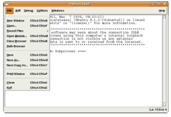
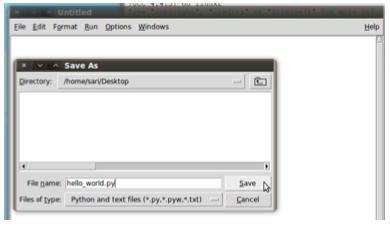

# Readings

How To Think Like A Computer Scientist: Monday - chapters 1 (all), 2 (all) & 4.12. Tuesday - Chapter 4.1, 4.2, 4.4-4.7, 6.1 & 6.2.

# What to turn in

Turn in a printout of your code exercises, stapled to your answers to the written exercises, at 2 PM on Wednesday, January 5th.

# Exercise 1.0 – Installing Python

Follow the instructions on installing Python and IDLE on your own computer on the Materials page of the course website, in the Handouts section. Be sure to install Python 2.6.x. Ask an LA for help if you run into any trouble. Before continuing, play around with the Python shell a bit and explore how you can use it as a calculator.

# Exercise 1.1 – Hello, world!

Recall that a program is just a set of instructions for the computer to execute. Let’s start with a basic command: print x: Prints the value of the expression x, followed by a new line.

Create a new program called hello world.py. You will use this file to write your very first ‘Hello, world!’ program, as well as your answers for the rest of the exercises for today. How to create a program file:

1. Open a new window by choosing New Window from the File menu.

	

2. Save the file as hello world.py. Do NOT skip the '.py' portion of the file name - otherwise, you will lose out on syntax highlighting!

	

3. Start every program with a bank of comments, with a comment line for your name, your recitation section, the name of your file, and today’s date. Recall that a comment line begins with a ‘#’ (pound) symbol.

You can now write your very own Hello, world! program. This is the first program that most programmers write in a new programming language. In Python, Hello world! is a very simple program to write. Do this now... it should be only be one line!

When you are done, save your work and run it. Your code should look similar to this:

To run your program, chose Run Module from the Run menu (or just hit F5 on Windows/Linux, or fn-F5 on a Mac). When you run the code, your shell should look similar to this:

When you run your code, it first prints the line >>> ===== RESTART =====, then runs your code underneath that line.
